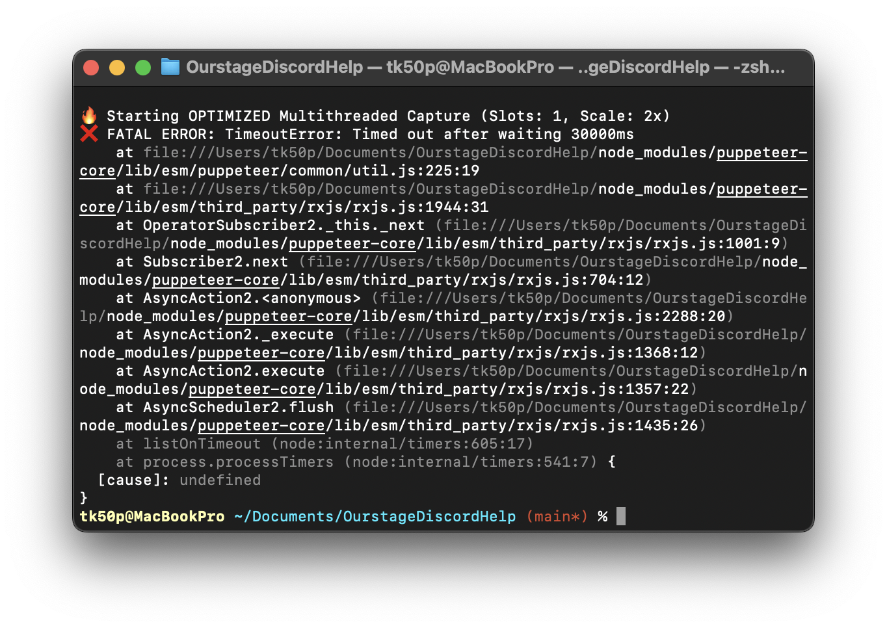

# OurStage Account Link Guide

A localized, web-based guide designed to help users link their **OurStage** accounts to Discord. This project provides a step-by-step visual instruction set, mimicking the Discord UI for a seamless user experience across multiple languages.

| English                          | Vietnamese                          |
| -------------------------------- | ----------------------------------- |
|  |  |

## 🚀 Features

- Multi-language support
- Step-by-step visual illustrations
- Automated GIF export for easy sharing and Discord bookmarking

## 🛠️ Technology Stack

- **Frontend**: [React](https://react.dev/) (React 19)
- **Styling**: [Tailwind CSS](https://tailwindcss.com/)
- **Internationalization**: [react-i18next](https://react.i18next.com/)
- **Automation**: [Puppeteer](https://pptr.dev/), [Sharp](https://sharp.pixelplumbing.com/)
- **Build Tool**: [Vite](https://vitejs.dev/)

## 📦 Getting Started

### Prerequisites

- [Node.js](https://nodejs.org/) (v16 or higher)
- npm or yarn

### Installation

1. Clone the repository:

    ```bash
    git clone <repository-url>
    cd OurstageDiscord
    ```

2. Install dependencies:

    ```bash
    npm install
    ```

### Development

Run the development server:

```bash
npm run dev
```

### Automation: Capturing Screenshots

To generate localized screenshots for all supported languages, run:

```bash
npm run capture
```

The output will be saved in the `output/` directory.

You can also specify the flag `-- --lang={lang}` (replacing `lang` with the language code, check supported language list below)

> [!warning]
> Don't forget to fire up local server first! Do it in second terminal since Vite will take that terminal until you close the server.

> [!caution]
> Some Mac may report the "Memory Allocation Error". I got a report from a user that it works fine on their Mac running MacOS 15.7.5 though. So I'm not sure what's the deal with that.
> 

## 🤖 Automation & CI/CD

This project uses **GitHub Actions** to automate guide generation and releases.

### Manual Trigger
You can manually trigger the generation from the **Actions** tab in the repository:
1. Select the **Capture Screenshots** workflow.
2. Click **Run workflow**.

### Automatic Capture
The capture process runs automatically on every push to the `main` branch. The resulting `.gif` files are uploaded as **job artifacts**, available for download from the workflow's summary page.

### Automated Releases
To trigger an automated GitHub Release:
1. Include the keyword `[Release]` in your commit message.
2. Push to the `main` branch.

The CI will generate all localized guides and publish them as a new Release, including both individual images and a bundled `.zip` file.


## 📂 Project Structure

- `locales/`: contains JSON translation files for each language (e.g., `en.json`, `vi.json`, `ja.json`).
- `capture.js`: The automation script that uses Puppeteer to cycle through languages and take screenshots.
- `src/`: The React source code.
    - `main.jsx`: Application entry point and i18n initialization.
    - `App.jsx`: Main application container and layout logic.
    - `components/`: Reusable React components (e.g., `DiscordUI`, `CommonMistakes`, `Step1-3`).
- `index.html`: The main visual entry point for the Vite build.
- `style.css`: Custom styling and Discord-specific UI overrides.

## 🌍 Adding a New Language

We welcome contributions for new languages! To add a new language, follow these steps:

1.  **Create a translation file**: Create a new JSON file in the `locales/` directory.
    *   Use the standard ISO language code (e.g., `fr.json` for French, `pt-BR.json` for Portuguese - Brazil).
    *   For specific dialects, you can use a custom suffix (e.g., `vi-NamBo.json`).
    *   The filename (without `.json`) will be used as the language identifier (e.g., `?lang=vi-NamBo`).

2.  **Translate the content**:
    *   **Base Template**: You can use any existing language file (e.g., `vi.json`, `ko.json`) as a base template for formatting, **except for `en.json`**.
    *   **Source of Truth**: You **must** use the text content from `en.json` as your reference for translation.
    *   **Important Note**: `en.json` contains the **complete** list of keys. Other files (like `vi.json`) intentionally omit keys that do not require translation for that specific language. By translating from `en.json`, you ensure you don't miss any keys that might need localization for your target language.
3.  **Enable Automation**: Add your new language code to the `languages` array in `capture.js` to include it in the automated screenshot process.
4.  **Register your contribution**: Add your language and username to the **Supported Languages** table below.


## 🌐 Supported Languages

We strive to make this guide accessible to as many players as possible. Currently, the following languages and variations are supported:

| Language                      | Code            | Contributor            | Type         |
| --------------------------    | --------------- | ---------------------- | ------------ |
| English                       | `en`            | BaoCreta, SweetSea     | Official     |
| English (TikTok Style)        | `en-tiktok`     | -                      | Fun          |
| Vietnamese                    | `vi`            | BaoCreta, SweetSea     | Official     |
| Vietnamese (Nam Bộ)           | `vi-NamBo`      | -                      | Dialect      |
| Vietnamese (Nghệ An)          | `vi-NgheAn`     | -                      | Dialect      |
| Vietnamese (Bình Dương)       | `vi-BinhDuong`  | -                      | Dialect      |
| Japanese                      | `ja`            | -                      | Official     |
| Korean                        | `ko`            | TK50P                  | Official     |
| Chinese                       | `zh`            | _not_kim               | Official     |
| Russian                       | `ru`            | Seripchik              | Official     |
| Spanish                       | `es`            | fka dayla (cinemagirl) | Official     |
| Italian                       | `it`            | Alessietto             | Official     |
| Portuguese - Brazil           | `pt-BR`         | yoki_to10              | Official     |
| French                        | `fr`            | aiken_gy               | Official     |

> [!NOTE]
> **Official** versions are intended for regular use and are the primary focus of this project. While **Dialect** versions are not recommended for most cases, they can still be used as alternatives to the standard guides. **Fun/Meme** versions should be avoided for actual guidance.
>
> In practice, the maintainer primarily uses and promotes the Official versions.

---

Developed with ❤️ for the OurStage community.
