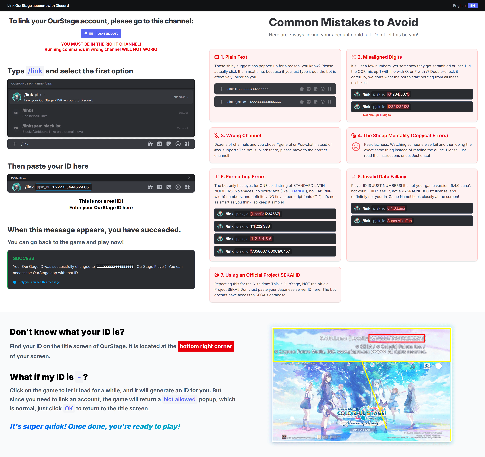
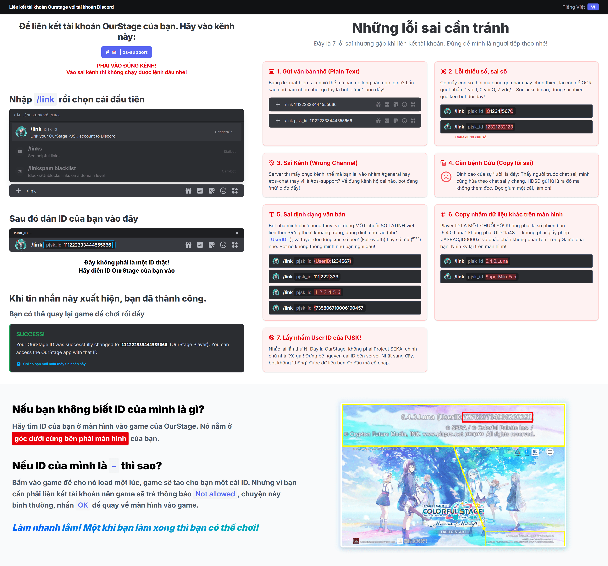

# OurStage Account Link Guide

A localized, web-based guide designed to help users link their **OurStage** accounts to Discord. This project provides a step-by-step visual instruction set, mimicking the Discord UI for a seamless user experience across multiple languages.

| English                          | Vietnamese                          |
| -------------------------------- | ----------------------------------- |
|  |  |

## 🚀 Features

- Multi-language support
- Step-by-step visual illustrations
- Automated GIF export for easy sharing and Discord bookmarking

## 🛠️ Technology Stack

- **Frontend**: HTML5, Vanilla JavaScript (ES Modules)
- **Styling**: [Tailwind CSS](https://tailwindcss.com/)
- **Internationalization**: [i18next](https://www.i18next.com/)
- **Automation**: [Puppeteer](https://pptr.dev/), [Sharp](https://sharp.pixelplumbing.com/)
- **Build Tool**: [Vite](https://vitejs.dev/)

## 📦 Getting Started

### Prerequisites

- [Node.js](https://nodejs.org/) (v16 or higher)
- npm or yarn

### Installation

1. Clone the repository:

    ```bash
    git clone <repository-url>
    cd OurstageDiscord
    ```

2. Install dependencies:

    ```bash
    npm install
    ```

### Development

Run the development server:

```bash
npm run dev
```

### Automation: Capturing Screenshots

To generate localized screenshots for all supported languages, run:

```bash
npm run capture
```

The output will be saved in the `output/` directory.

You can also specify the flag `-- --lang={lang}` (replacing `lang` with the language code, check supported language list below)

## 🤖 Automation & CI/CD

This project uses **GitHub Actions** to automate guide generation and releases.

### Manual Trigger
You can manually trigger the generation from the **Actions** tab in the repository:
1. Select the **Capture Screenshots** workflow.
2. Click **Run workflow**.

### Automatic Capture
The capture process runs automatically on every push to the `main` branch. The resulting `.gif` files are uploaded as **job artifacts**, available for download from the workflow's summary page.

### Automated Releases
To trigger an automated GitHub Release:
1. Include the keyword `[Release]` in your commit message.
2. Push to the `main` branch.

The CI will generate all localized guides and publish them as a new Release, including both individual images and a bundled `.zip` file.


## 📂 Project Structure

- `locales/`: contains JSON translation files for each language (e.g., `en.json`, `vi.json`, `ja.json`).
- `capture.js`: The automation script that uses Puppeteer to cycle through languages and take screenshots.
- `main.js`: The core logic for initializing i18n and rendering the guide.
- `index.html`: The main visual structure of the guide.
- `style.css`: Custom styling and Discord-specific UI overrides.

## 🌍 Adding a New Language

We welcome contributions for new languages! To add a new language, follow these steps:

1.  **Create a translation file**: Create a new JSON file in the `locales/` directory. 
    *   Use the standard ISO language code (e.g., `fr.json` for French, `pt-BR.json` for Portuguese - Brazil).
    *   For specific dialects, you can use a custom suffix (e.g., `vi-NamBo.json`).
    *   The filename (without `.json`) will be used as the language identifier (e.g., `?lang=vi-NamBo`).

2.  **Translate the content**:
    *   **Base Template**: You can use any existing language file (e.g., `vi.json`, `ko.json`) as a base template for formatting, **except for `en.json`**.
    *   **Source of Truth**: You **must** use the text content from `en.json` as your reference for translation.
    *   **Important Note**: `en.json` contains the **complete** list of keys. Other files (like `vi.json`) intentionally omit keys that do not require translation for that specific language. By translating from `en.json`, you ensure you don't miss any keys that might need localization for your target language.
3.  **Enable Automation**: Add your new language code to the `languages` array in `capture.js` to include it in the automated screenshot process.
4.  **Register your contribution**: Add your language and username to the **Supported Languages** table below.


## 🌐 Supported Languages

Currently, the guide is available in:

| Language                   | Contributor            |
| -------------------------- | ---------------------- |
| English (`en`)             | BaoCreta, SweetSea     |
| Vietnamese (`vi`)          | BaoCreta, SweetSea     |
| Japanese (`ja`)            | -                      |
| Korean (`ko`)              | TK50P                  |
| Chinese (`cn`)             | _not_kim               |
| Russian (`ru`)             | Seripchik              |
| Spanish (`es`)             | fka dayla (cinemagirl) |
| Italian (`it`)             | Alessietto             |
| Portuguese - Brazil (`pt`) | yoki_to10              |

There are 2 dialects version of Vietnamese:

- Nam Bộ dialect (`vi-NamBo`)
- Nghệ An dialect (`vi-NgheAn`)

By default they are not being used in real life, for pure just-for-fun purpose.

---

Developed with ❤️ for the OurStage community.
